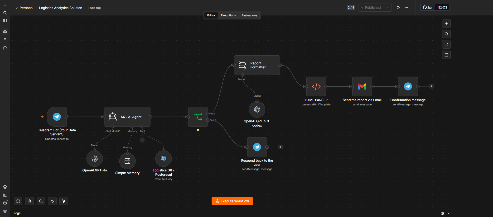
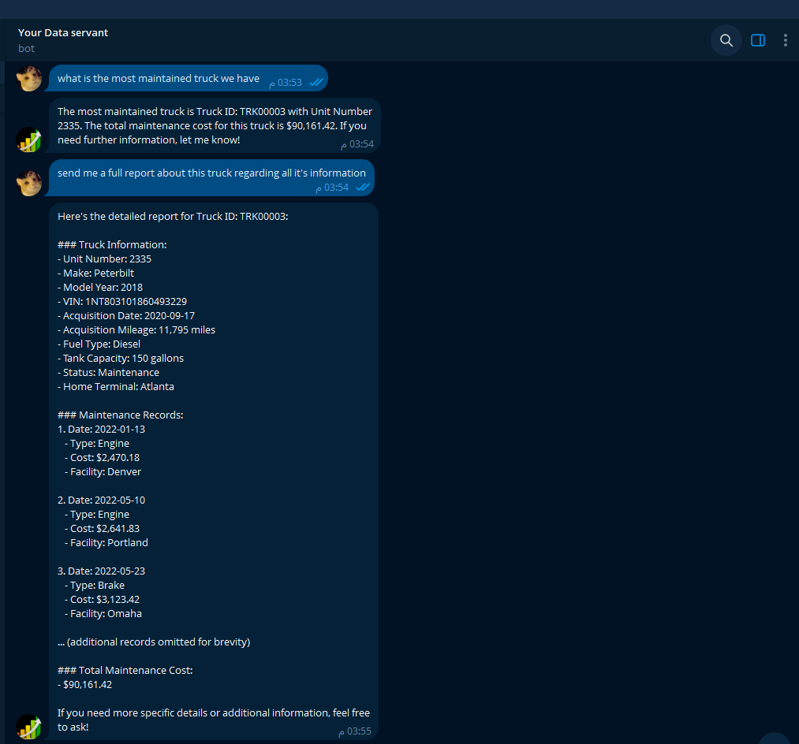
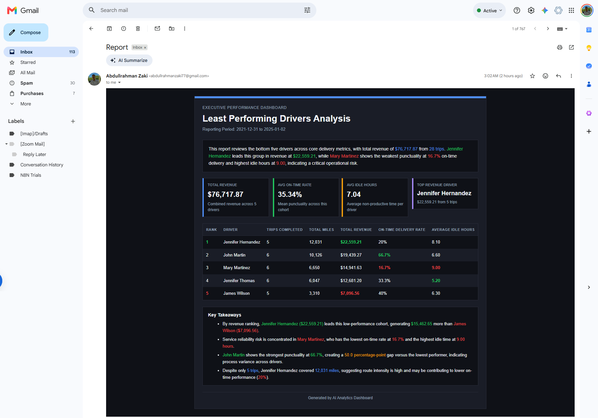

# Logistics Analytics Solution (n8n + AI Agent)

A self-hosted n8n automation that lets users query a logistics data warehouse via natural language through Telegram, with AI-generated reports routed to Telegram or Gmail based on user intent.

## Architecture

```
Telegram Bot → SQL AI Agent (gpt-4o) → If Node (route check)
                                          ├── true  → Report Formatter (gpt-5.3-codex) → HTML Parser → Gmail
                                          └── false → Telegram reply
```



## How it works

1. User sends a natural language question to the Telegram bot (e.g. "show me our least performing drivers")
2. The SQL AI Agent (gpt-4o) interprets the request, writes a PostgreSQL query against the `logistics_dwh` star schema on Supabase, executes it via the Postgres tool, and builds an analytical response
3. If the user asked for the report via email, the agent appends a `[ROUTE:EMAIL]` tag to its output
4. The If node checks whether the response contains `[ROUTE:EMAIL]`:
   - **True** → Report Formatter (gpt-5.3-codex) converts the data into an HTML report → HTML Parser generates the email template → sent via Gmail
   - **False** → response sent directly back to the user on Telegram

## Database Schema

PostgreSQL star schema hosted on Supabase (`logistics_dwh`), 10 tables:

**Dimensions (6):** dim_date, dim_drivers, dim_trucks, dim_customers, dim_facilities, dim_routes

**Facts (5):** fact_loads, fact_trips, fact_maintenance, fact_deliveryevents, fact_drivermonthlymetrics

All joins use surrogate `_key` columns. Date filtering routes through `dim_date` for flexible period queries (YTD, last month, by quarter, etc.).

## Sample interaction

**User:** "Create a report about our least performing drivers and send it to my email"

**Agent:**
1. Queries `fact_drivermonthlymetrics` joined with `dim_drivers` and `dim_date`, ranking by on-time delivery rate and average MPG
2. Detects the email request, appends `[ROUTE:EMAIL]`
3. Report Formatter builds an HTML summary
4. Email delivered with full driver performance breakdown

**Telegram response:**



**Email report:**



## Tech Stack

- **n8n** — self-hosted via npm on Windows
- **Telegram Bot API** — user interface, tunneled via ngrok
- **OpenAI** — gpt-4o (SQL agent), gpt-5.3-codex (report formatting)
- **Supabase PostgreSQL** — data warehouse
- **Gmail** — email delivery for formatted reports

## Setup Notes

- Requires n8n running locally (`npm install n8n -g` → `n8n start`)
- ngrok tunnel exposes the local Telegram webhook endpoint
- Supabase Postgres credentials configured in n8n's credential manager
- OpenAI credentials shared across both Chat Model nodes

## Repository Structure

```
.
├── workflow.json          # n8n workflow export
├── README.md
└── assets/
    ├── workflow-overview.png
    ├── telegram-response.png
    └── email-report.png
```
